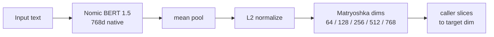

`lettuce-emb-768d-v4` is the new embedding model for LettuceAI's memory layer. It ships at [`Zeolit/lettuce-emb-768d-v4`](https://huggingface.co/Zeolit/lettuce-emb-768d-v4) under Apache 2.0.

## Headline numbers

| Metric | v3 | v4 release | Change |
| ------ | -- | ---------- | ------ |
| RP recall@1 | 0.020 | **0.924** | **46.2x** |
| RP recall@5 | 0.109 | **0.982** | **9.0x** |
| STSBenchmark Spearman | 0.809 | **0.819** | +0.010 |
| Output dimension | 512d | **768d native** | no Dense bottleneck |
| Matryoshka dims | no | **64 / 128 / 256 / 512 / 768** | one model, multiple tiers |

v4 fixes the roleplay retrieval failure without giving up general sentence similarity. The embedding model is the memory layer for LettuceAI: it embeds conversation history so the app can retrieve relevant context before generating the next reply. v3 could not do that reliably. v4 can.

## If you just want to roleplay

Skip the tables. Here is what changes for you:

- **Your character actually remembers.** Bring up something from 100 messages ago and the model finds it instead of pulling a random line.
- **Long stories hold together.** Past chapters, settings, in-jokes, and lore stay reachable as the chat grows.
- **It works on your hardware.** v4 ships in tiers. Old phone, mid-range laptop, or a desktop GPU all get something good. The app picks the right tier for you.
- **Nothing leaves your device.** Same as before. Your roleplay stays local.

If v3 felt like the bot had goldfish memory, v4 is the fix.

## v3 vs v4

| Decision | v3 | v4 |
| -------- | -- | -- |
| Backbone | `nomic-ai/nomic-embed-text-v1.5` | `nomic-ai/nomic-embed-text-v1.5` |
| Output | 512d via Dense projection | **768d native hidden state** |
| Training framework | Sentence Transformers trainer | **custom PyTorch loop** |
| Pair batch | 4 | **128** (warmup) |
| In-batch negatives | 3 per anchor | **127 per anchor** |
| Hard negatives | none | **BGE-M3 mined + per-epoch refresh** |
| Matryoshka | no | **dims [64, 128, 256, 512, 768]** |
| RP training data | ~7,800 rows | **~285k query/passage rows** |
| Loss recipe | MNR + CosineSim | **MNR + CosineSim + MarginMSE + STS replay** |
| Export | none | **ONNX FP32 + INT8** |

Same backbone. The training-signal change is what turns it into a different model.

## Benchmark

Both released ONNX models, 5,000 deterministic test queries. Queries come from BookSum chapter summaries (long-context retrieval) and persona dialogue prefixes (self-retrieval where the first 30% of a passage retrieves the rest).

| Tier | Haystack | What it tests | v3 recall@1 | **v4 recall@1** |
| ---- | -------- | ------------- | ----------- | --------------- |
| A — sanity | 500 passages | small-corpus retrieval | 0.610 | **0.902** |
| B — extreme | **144k passages** | production-realistic full-corpus retrieval | 0.157 | **0.512** |
| C — long-context | 4k BookSum chapters | summary to chapter, real human queries | 0.370 | **0.826** |

The headline is **Tier B**: v4 is 3.3× better than v3 on the realistic 144k-passage haystack. That is the size of corpus a heavy LettuceAI user accumulates over months, and where production retrieval quality actually gets tested.

v3 falls off a cliff as the haystack grows. v4 degrades gracefully. That gap is what the hard-negative training was for.

Full numbers:

| Tier / model | recall@1 | recall@5 | recall@10 | MRR@10 |
| ------------ | -------- | -------- | --------- | ------ |
| Tier A v3 | 0.610 | 0.768 | 0.822 | 0.680 |
| Tier A v4 | **0.902** | **0.948** | **0.956** | **0.925** |
| Tier B v3 | 0.157 | 0.283 | 0.336 | 0.212 |
| Tier B v4 | **0.512** | **0.769** | **0.815** | **0.628** |
| Tier C v3 | 0.370 | 0.602 | 0.684 | 0.468 |
| Tier C v4 | **0.826** | **0.973** | **0.984** | **0.892** |

### Matryoshka quality across dims

Matryoshka is named after the Russian nesting dolls. The model produces one 768-number vector, but the most important information is packed into the first 64 numbers, then the next 64, and so on. So a low-end phone can keep just the first 64 and still get useful retrieval, while a desktop can keep all 768 for the best quality. One model, one file, every device picks how much of it to use.

Even at 64d (12× smaller vectors), v4 stays well above v3's 768d performance.

| v4 dim | bytes | recall@1 | recall@5 | recall@10 | MRR@10 |
| ------ | ----- | -------- | -------- | --------- | ------ |
| 64d  | 256   | 0.424 | 0.648 | 0.698 | 0.523 |
| 128d | 512   | 0.488 | 0.723 | 0.768 | 0.591 |
| 256d | 1,024 | 0.504 | 0.752 | 0.796 | 0.614 |
| 512d | 2,048 | 0.509 | 0.767 | 0.808 | 0.622 |
| 768d | 3,072 | **0.512** | **0.769** | **0.815** | **0.628** |

Queries and passages are drawn from sources v4 saw during training, so this is in-distribution retrieval quality. v3 was tested on the same set, so the comparison is fair, and the absolute numbers reflect what users experience in normal app usage over their own data.

## Architecture

v3 projected Nomic's 768d hidden states down to 512d through a learned Dense layer. v4 removes that bottleneck and pools the native 768d directly.

## Training

Three-stage curriculum, ~285k pairs/triplets across roleplay/persona, long-form narrative, and general retrieval data, with BGE-M3 hard negatives refreshed per epoch.

| Stage | Seq len | Batch | Negatives | Losses |
| ----- | ------- | ----- | --------- | ------ |
| 1 warmup | 512 | 128 pairs | in-batch | MNR |
| 2 main | 2048 | 16 triplets | hard negatives | MNR + Cosine distillation |
| 3 refinement | 4096 | 8 triplets | refreshed hard negatives | MNR + Cosine + MarginMSE + STS replay |

Hard negatives are the main reason v4 works. In v3, wrong passages were mostly random. In v4, wrong passages are close enough to be tempting, so the model has to learn the difference between "same general vibe" and "actually the memory the user needs."

## Specs

| | |
| --- | --- |
| Backbone | `nomic-ai/nomic-embed-text-v1.5` |
| Parameters | 137M |
| Output dimension | 768d (Matryoshka-sliceable to 64 / 128 / 256 / 512) |
| Context length | 4096 tokens |
| Pooling | mean over tokens, L2 normalize |
| ONNX FP32 | `final/onnx/model.fp32.onnx` — 547.7 MB |
| ONNX INT8 | `final/onnx/model.int8.onnx` — 138.0 MB |
| License | Apache 2.0 |
| Model card | [`Zeolit/lettuce-emb-768d-v4`](https://huggingface.co/Zeolit/lettuce-emb-768d-v4) |

## Coming after v4

v4-pro is in design. The two structural changes: queries that adapt to the conversation around them, and a model that quietly learns your voice on your own machine.

A personal memory model, not a generic retriever.
