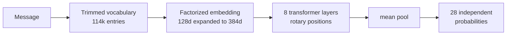

`lettuce-thymos-26m-v1` is the new emotion model for LettuceAI. It reads a message and returns which of 28 emotions are in it, in 22 languages, from a 28 MB file that runs on the phone. It ships at [`Zeolit/lettuce-thymos-26m-v1`](https://huggingface.co/Zeolit/lettuce-thymos-26m-v1) under Apache 2.0.

It replaces `SamLowe/roberta-base-go_emotions`, the model LettuceAI has been running until now. That model is good at what it does. It only does it in English, and most of you are not writing in English.

This is the part of Companion Mode that reads you. Every message you send a companion passes through an on-device emotion reader before the reply is written, and the labels it returns are what move the companion's emotional state and the relationship meters. Get that wrong and the companion still answers, warmly and in character. The bond underneath it is just being updated from noise.

We did not fine-tune somebody else's classifier. The architecture, the vocabulary, the training pipeline and the evaluation harness are ours, and the weights start from random numbers. Before any of that we went looking for a multilingual model on the full 28-label GoEmotions taxonomy that would fit on a phone. There is not one. So we trained it.

It arrives with LettuceAI Next, the ground-up rewrite of the app.

*Thymos* (θυμός) is the Homeric Greek word for the seat of emotion.

## The short version

| Metric | lettuce-thymos-26m-v1 | Best public alternative |
| ------ | --------------------- | ----------------------- |
| Languages | **22** | 1 (English) |
| Emotions | **28** | 28 |
| Accuracy across 22 languages | **0.446** | 0.185 |
| Accuracy in English | 0.527 | 0.542 |
| Parameters | **26.5M** | 395M |
| File size | **28 MB** | 1.6 GB |
| Speed on a desktop CPU | **2.7 ms** | not measured on device |

The alternative column is `cirimus/modernbert-large-go-emotions`, the strongest public GoEmotions model we could find. Accuracy is macro-F1: every emotion counts the same, so a model cannot look good by only getting the common ones right.

Green is the new model. Grey is the one the app has been using, at five times the parameters. In English the two sit close together, and that matters: we did not trade English away to get the rest. Everywhere else the gap is the width of the chart.

If you use LettuceAI in Turkish, Russian, Arabic or Japanese, the grey dot is what your messages were being read with until now.

## Where it sits in Companion Mode

A companion turn is not one step. Before your companion says anything, the app relaxes their previous mood toward baseline, reads your message, nudges their feelings, runs those feelings through their regulation style to work out what they will actually show, and only then writes the reply with all of that in view.

This model is the reading step. Everything after it is downstream of what it returns.

That places four specific demands on it, and each one shaped a decision:

- **Twenty-eight labels, not six.** Closeness, trust, affection, tension and stability do not respond to a single "positive" signal. Gratitude, admiration and love are three different pushes on three different meters. A six-emotion model collapses all of that into one number.
- **More than one feeling per message.** "I'm sorry. I shouldn't have said that to you, any of it." reads as remorse at 0.71 and sadness at 0.24, and both clear their thresholds. Both nudges land, instead of the meters seeing whichever one won a softmax.
- **Your language, not just English.** The docs say that when the reader is unavailable, the companion applies a near-neutral update and pauses emotional change until it is back. In Arabic the previous model scored 0.041 in our evaluation. Functionally, that was already happening. Now it scores 0.354, and in Turkish 0.407 against 0.094.
- **Fast enough to sit in front of the reply.** It runs on every turn, on your device, before generation starts. 28 MB, a few milliseconds, no server call.

It also never leaves your device. The reading, the memory lookups and the state updates all happen locally. The only thing that reaches your provider is the reply itself, exactly as before.

The rest of Companion Mode was already built to use this well. A guarded companion can be hurting without ever saying so, because what they feel and what they show are tracked separately. That distinction only means anything if the felt reading was right in the first place.

## Small on purpose

Emotion models are usually 125M to 400M parameters, which means a download of several hundred megabytes and a round trip to a server on most phones. That is the wrong shape for something that has to score every message as you type.

Left side is what you download, so shorter is better. Right side is how well it reads emotion across 22 languages, so longer is better. Our row is the short bar on one side and the long bar on the other.

Look at the English score under each name too. We sit level with models five and fifteen times the size, inside 0.015 of the best of them, and then win the other column outright. Small usually means giving something up. Here it did not.

None of that came from a smaller version of an existing model. It came from three specific decisions about how the model stores what it knows, which are in [How it was built](#how-it-was-built) further down.

Speed, measured on an Intel i7-10700K, batch of one, ONNX Runtime on CPU:

| Threads | Short message | Medium | Long |
| ------- | ------------- | ------ | ---- |
| 1 | 6.4 ms | 12.2 ms | 24.6 ms |
| 2 | 3.8 ms | 7.2 ms | 13.9 ms |
| 4 | 2.7 ms | 4.7 ms | 8.9 ms |

## Then we tested it on somebody else's data

Numbers on your own benchmark are easy. Our training text was translated by machine, so a model could in principle score well by learning the translator rather than the language. We wanted to know whether that was happening, so we went and found a test we had nothing to do with.

BRIGHTER (SemEval-2025 Task 11) is 28 languages of text written natively by the people who speak them, annotated by hand, released under CC-BY 4.0. No model in this post was trained on it. The emotion labels are a different set, mapped onto ours. Different data, different domain, different taxonomy, no fine-tuning.

It held. Read the first panel, then the other two. In English all four models land within 0.027 of each other. One panel to the right, on text nobody here was trained on, the gap is roughly twofold in our favour.

The third panel is languages we never trained on at all, and we lead there too. So the gain is not memorised vocabulary. It carries into languages the model has only ever met through its backbone.

The move from Reddit text to human writing is also where the large models show their edges. `modernbert-large`, the biggest model in the comparison, drops the furthest and finishes last in English:

| model | GoEmotions English | BRIGHTER English | change |
| ----- | ------------------ | ---------------- | ------ |
| roberta-base-go_emotions | 0.505 | 0.505 | 0.000 |
| modernbert-base | 0.535 | 0.520 | -0.015 |
| lettuce-thymos-26m-v1 | 0.527 | 0.502 | -0.025 |
| modernbert-large | 0.542 | 0.493 | -0.049 |

395M parameters bought a 0.015 lead on Reddit and lost it entirely the moment the text came from somewhere else.

Sorted by score rather than grouped by colour, because the mixing is the interesting part. Romanian sits above English, and we never trained on Romanian. Javanese, Marathi and Sundanese all land in the upper half. The model is reaching languages it only met through its backbone.

The bottom of the list is deliberate. Those languages appear nowhere in our training and nowhere in the backbone, and they score exactly where they should. We left them in because a benchmark with no floor in it is not a benchmark.

## How it was built

Six stages, and the decision that shaped each one.

### Making the data

There is no multilingual GoEmotions. There is an English one: 58,000 Reddit comments, hand labelled with 27 emotions plus neutral. So we translated it with `facebook/m2m100_1.2B`, all 58,000 comments into 21 more languages, which comes out at 955,020 training rows.

Every language passes an automatic check before its output is accepted: empty output, repeated output, output still in the source language, Latin characters where a non-Latin script belongs. A translator can degrade quietly, and a million rows is too many to read.

### Training a teacher

A large model learns this task better than a small one, so we trained the large one first and used it as a reference. `XLM-RoBERTa-large`, 560M parameters, fine-tuned across all 22 languages at once.

It is far too big to ship. It never needed to be.

### Building something small enough to ship

Then the actual model, designed from scratch around one constraint: it has to fit on a phone and run before every reply.

Three decisions did most of the work.

**The vocabulary was cut.** The tokenizer it inherits knows 250,002 word pieces, most of them for languages we do not cover. We kept the 114,087 that our 22 languages actually use. In the worst case, Arabic, that leaves about 0.09% of tokens unrecognised, which is small enough to be free.

**The word table was factorized.** This is the one that matters. Storing 114,087 words at the model's full internal width would take 43.8M parameters, which is more than the entire finished model. Instead each word is stored as 128 numbers and expanded to 384 on the way in. Same vocabulary, 14.6M parameters.

**Positions are computed, not stored.** Most models keep a lookup table for "this is the fifth word". This one works the position out with rotation, which removes the table and handles unfamiliar lengths better.

The result: 8 layers, 384 wide, 26.5M parameters total.

### Teaching it

The small model was not trained on the labels. It was trained on the large model's answers.

That sounds like a downgrade and it is the opposite. A label says "this is gratitude, this is not admiration". The teacher's output says "0.81 gratitude, 0.44 admiration, 0.12 relief", which tells the student how close each call was and what tends to appear alongside what. It is a far richer signal per example, and it is why 26.5M parameters land within 0.016 of the 560M teacher.

Twenty epochs, and we kept epoch six. The checkpoint is picked on a threshold-free score over held-out data, so the choice does not depend on where the cutoffs happen to sit.

### Deciding what counts

A model this shape outputs 28 independent probabilities. Something has to turn those into "yes, this message is grateful".

The obvious rule, anything above 0.5, is a bad one. Rare emotions almost never reach 0.5, so a flat cutoff throws most of them out and the score for those classes collapses. Instead every emotion gets its own threshold, tuned on held-out data.

The folds are grouped by the original English comment, so the same comment in 22 languages never lands on both sides of the split. Without that grouping the tuning reads answers it has already seen in another language, and every threshold comes out too confident.

### Shrinking it for release

The shipped file stores its numbers as 8-bit integers instead of 32-bit floats. Standard practice, usually a small quality loss.

It was not one here. The int8 build scored 0.4469 against the float build's 0.4463, and 0.058% of individual yes/no decisions changed. The compression is effectively free.

The word table is quantized separately, with its own scale per row. Standard tooling covers the matrix multiplications and skips lookup tables, and the lookup table is the largest single thing in this model.

| | |
| --- | --- |
| Source data | GoEmotions, 58k Reddit comments, 27 emotions plus neutral |
| Translation | `facebook/m2m100_1.2B` |
| Training rows | 955,020 across 22 languages |
| Teacher | `XLM-RoBERTa-large`, 560M parameters |
| Student | 26.5M parameters, 20 epochs of distillation, epoch 6 kept |
| Thresholds | Per emotion, tuned on source-grouped validation folds |
| Release | int8 ONNX, 28 MB |

## The edges

Where the next version goes:

- Five of the 28 emotions sit below the average, `grief` and `relief` among them. Those are exactly the ones a long companion relationship runs into, and GoEmotions contains 77 grief examples in the entire dataset. A data problem with a data answer.
- Arabic and Swahili are the two languages we want to lift. Both need text written by people rather than translated by a machine.
- It is trained on text where people say what they feel, because that is what Reddit comments are. "I'm so scared to go home now" reads as fear at 0.96. "Something moved in the hallway, I'm not imagining it this time" reads as neutral. Narrative writing that shows a feeling instead of naming it is the gap we care most about closing, and it is a property of the training data rather than the model.
- It reads the message, not the person. It moves a companion's meters. It is not a mental health tool and should not be used as one.

## The details

| | |
| --- | --- |
| Parameters | 26.5M |
| Architecture | 8 layers, 384 hidden, 6 heads, RoPE |
| Labels | 28 GoEmotions emotions, multi-label |
| Languages | en, es, fr, de, pt, it, nl, ru, pl, uk, ar, fa, hi, bn, zh, ja, ko, vi, th, id, sw, tr |
| Context | 128 tokens, longer input handled by overlapping windows |
| ONNX INT8 | 28 MB |
| ONNX FP32 | 62 MB |
| License | Apache 2.0 |
| Model card | [`Zeolit/lettuce-thymos-26m-v1`](https://huggingface.co/Zeolit/lettuce-thymos-26m-v1) |

Everything in this post is reproducible. The evaluation outputs for all five models, both benchmarks, are in the `evaluation/` folder of the repository.

Companion Mode is opt-in and always has been. If you never turn it on, none of this runs.
